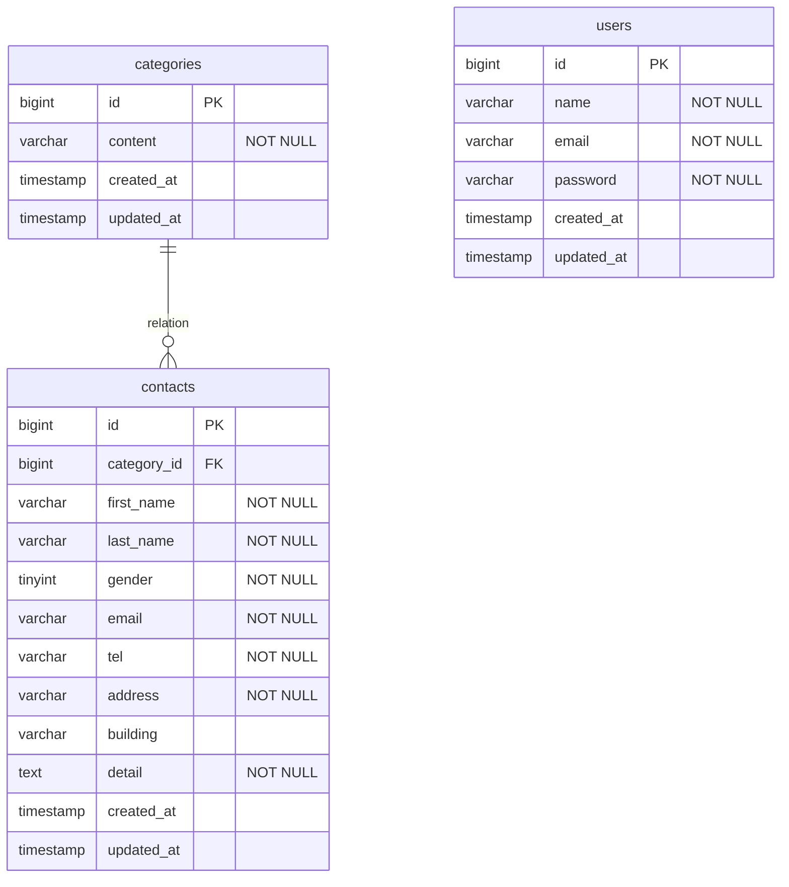

# アプリケーション名
FashionablyLate（お問い合わせフォーム / 管理画面システム）

## 環境構築

### Docker・Laravel環境構築
* git clone https://github.com/rikom20/contact-form-app.git
* cp .env.example .env,環境変数を適宜変更
* composer install
* ./vendor/bin/sail up -d(※ alias 設定済みの場合は sail up -d でも可,以下同)
* ./vendor/bin/sail artisan key:generate

### マイグレーションとダミーデータの投入
* ./vendor/bin/sail artisan migrate
* ./vendor/bin/sail artisan db:seed

### 開発環境（URL）
* お問い合わせ画面：http://localhost/
* ユーザー登録画面：http://localhost/register
* ログイン画面：http://localhost/login
* 管理画面：http://localhost/admin
* phpMyAdmin：http://localhost:8080/

### 使用技術（実行環境）
* PHP 8.1.2
* Laravel 10.50.2
* MySQL 8.4.10
* Tailwind CSS

### ER図

